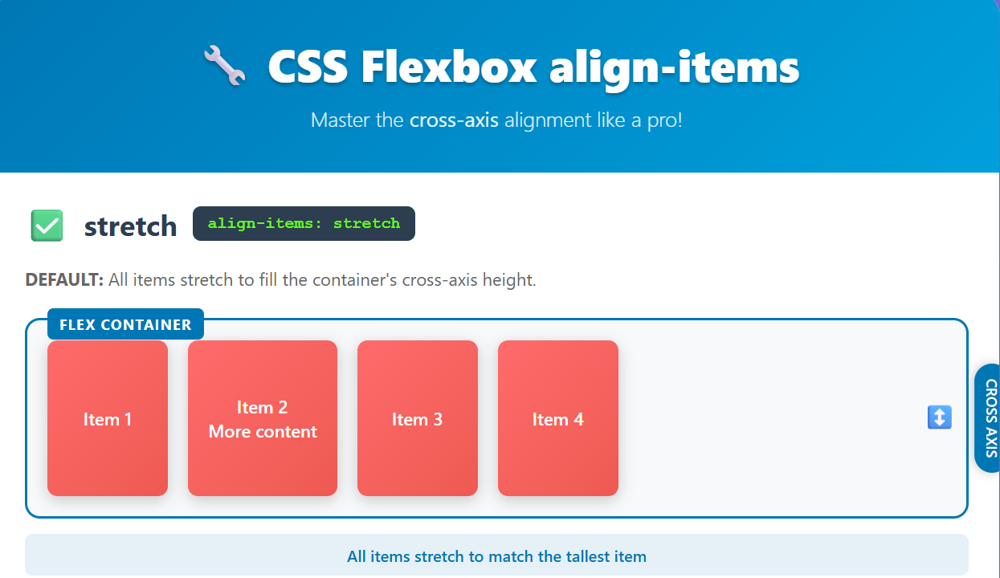
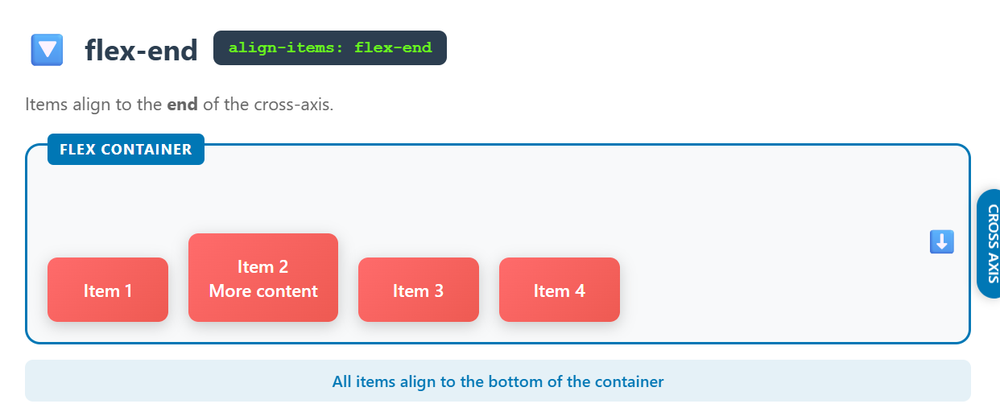
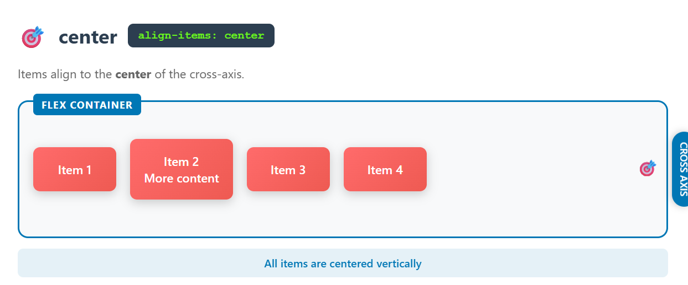
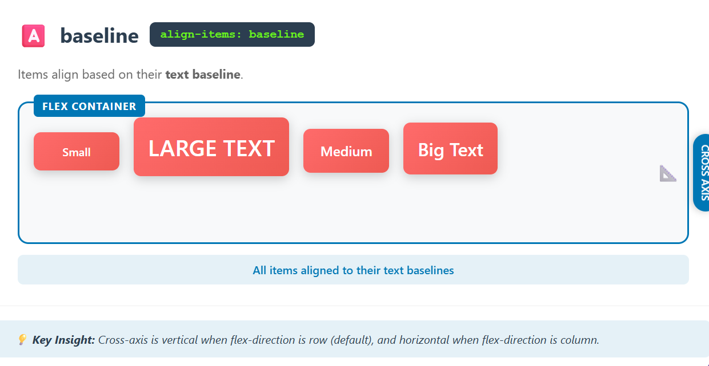

## 📁 Project Title: CSS Flexbox align-items — Visual Guide for Beginners

## 🔍 Description  
This project is a **visual UI guide** to help beginners understand how the CSS Flexbox `align-items` property works across five key values:

✅ stretch  
🔼 flex-start  
🔽 flex-end  
🎯 center  
🅰️ baseline  

It uses **pure HTML & CSS** — no frameworks, no JavaScript — to deliver a hands-on learning experience.

## 👨‍💻 Built With  
HTML5  
CSS3  
Prompt Engineering (used with AI to visualize the idea)  
Canva (for layout/preview support)

## 💡 Why This Project?  
As a Generative AI learner, I wanted to apply **prompt engineering** practically.  
Instead of relying on tutorials, I tried crafting something that's:

🧠 Visually explanatory  
🎓 Useful for beginners  
✨ Clean, responsive and beautiful

## 🤝 Acknowledgment  
This project was created as part of my learning journey in **Frontend + Generative AI**.  
Special thanks to my constant companion: **AI + Canva + Curiosity** 😊

## 🧠 Suitable For  
- Beginners learning CSS Flexbox  
- Visual learners  
- Frontend developers revisiting basics  
- Prompt Engineering + UI experiments

## 📌 Status  
✅ Completed (but open for feedback or extension)

## 📸 Screenshot Preview 

  
  
  
  

